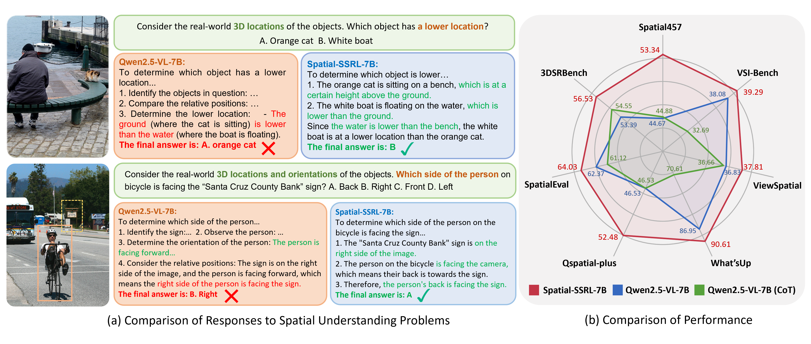
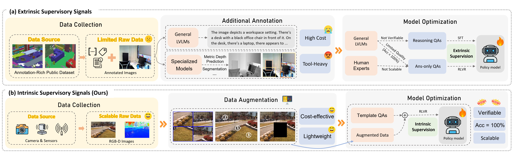

  <h1 align="center">
    

      

        Spatial-SSRL: Enhancing Spatial Understanding via Self-Supervised
Reinforcement Learning
      

    

  </h1>
  

    <a href="https://scholar.google.com/citations?hl=en&user=yQ8U3tUAAAAJ"><strong>Yuhong Liu</strong></a >
    ·
    <a href="https://beichenzbc.github.io/"><strong>Beichen Zhang</strong></a >
    ·
    <a href="https://yuhangzang.github.io/"><strong>Yuhang Zang&dagger;</strong></a >
    ·
    <a href="https://scholar.google.com/citations?user=sJkqsqkAAAAJ"><strong>Yuhang Cao</strong></a >
    ·
    <a href="https://github.com/Cooperx521"><strong>Long Xing</strong></a >
     
    <a href="https://lightdxy.github.io/"><strong>Xiaoyi Dong</strong></a >
    ·
    <a href="https://github.com/kennymckormick"><strong>Haodong Duan</strong></a >
    ·
    <a href="http://dahua.site/"><strong>Dahua Lin</strong></a >
    ·
     <a href="https://myownskyw7.github.io/"><strong>Jiaqi Wang&dagger;</strong></a >
  

  
  &dagger;Corresponding authors. 

  

    🏠<a href="https://github.com/InternLM/Spatial-SSRL">Homepage</a >
  | 🤗<a href="https://huggingface.co/internlm/Spatial-SSRL-7B">Spatial-SSRL-7B Model</a >
  | 🤗<a href="https://huggingface.co/datasets/internlm/Spatial-SSRL-81k">Spatial-SSRL-81k Dataset</a >
  
 

## 📢 News

## 🌈 Overview
We are thrilled to introduce <strong>Spatial-SSRL</strong>, a novel self-supervised RL paradigm aimed at enhancing LVLM spatial understanding. 
By optimizing Qwen2.5-VL-7B with Spatial-SSRL, the model exhibits stronger spatial intelligence across seven spatial understanding benchmarks in both image and video settings.

 
   

Spatial-SSRL is a <strong>lightweight</strong> tool-free framework that is natually compatible with the RLVR training paradigm and easy to extend to a multitude of pretext tasks.
Five tasks are currently formulated in the framework, requiring only ordinary RGB and RGB-D images. <strong>And we welcome you to join Spatial-SSRL with effective pretext tasks to further strengthen the capabilities of LVLMs!</strong>

 
   

## 💡 Highlights
- 🔥**Highly Scalable:** Spatial-SSRL uses ordinary raw RGB and RGB-D images instead of richly-annotated public datasets or manual labels for data curation, making it highly scalable.
- 🔥**Cost-effective:** Avoiding the need for human labels or API calls for general LVLMs throughout the entire pipeline endows Spatial-SSRL with cost-effectiveness.
- 🔥**Lightweight:** Prior approaches for spatial understanding heavily rely on annotation of external tools, incurring inherent errors in training data and additional cost. In constrast, Spatial-SSRL is completely tool-free and can easily be extended to more self-supervised tasks. 
- 🔥**Naturally Verifiable:** Intrinsic supervisory signals determined by pretext objectives are naturally verifiable, aligning Spatial-SSRL well with RLVR.

 
   

## 📊 Experimental Results
